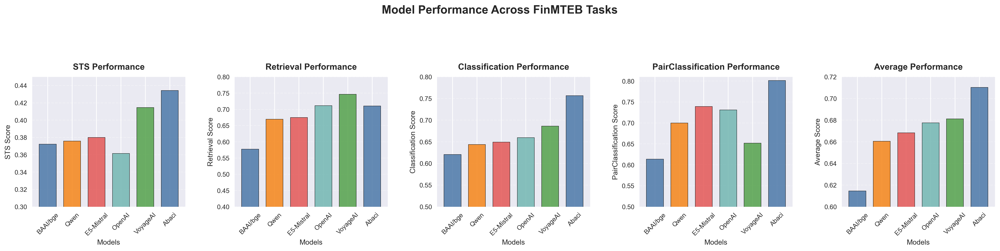

Are you a buy-side or sell-side analyst, overwhelmed by the sheer volume of financial reports and news? In the age of AI, you’ve probably considered using RAG (retrieval-augmented generation) to quickly index your data repositories, allowing you to instantly retrieve the critical information you need.

Are you a quantitative researcher extracting signals from financial text to generate alpha? If so, you’re likely looking beyond traditional sentiment signals to tap into the deeper predictive power hidden in the text data.

In both cases, you need an **embedding model**. An embedding model transforms text data into vector representations, enabling machines to understand the semantic content of text. Commercial companies such as OpenAI provide general-purpose embedding models, but they are not optimized for specific domains like finance.

Introducing **abaci-text-v1**, our state-of-the-art embedding model tailored specifically for financial text data. Abaci can supercharge your downstream tasks, from equity research to building text-based signals for your quantitative models.

## Why Do You Need an Embedding Model Tailored for Financial Text?

Most state-of-the-art embedding models use contrastive learning, taking a general-purpose pre-trained language model and fine-tuning it with contrastive loss. These models are often based on well-known architectures like Qwen, Mistral, or Llama. The fine-tuning is typically performed on general NLP or syntactic datasets, which work well for general purposes.

However, financial text is unique. It’s often long, messy, and filled with jargon, along with irrelevant details that are not useful for tasks such as quantitative model building or precise semantic matching in RAG systems.

### Consider the following example:
- **“The company revenue will grow.”**
- **“The company revenue will grow significantly.”**

A general-purpose model might produce similar embeddings for these two sentences, suggesting that they are almost identical. However, the second sentence carries more important information that could have a significant impact on a company’s stock price. Abaci Embedding focuses on understanding the nuances of financial text and embedding it in a way that enhances its predictive power.

## How Do Abaci Embeddings Work?

We do things differently. Unlike other models that rely heavily on financial text datasets for training, Abaci focuses on creating embeddings with superior generalization capabilities. TaskPersona, our unique patent-pending data augmentation framework, is key. By introducing task-aware, context-specific queries, we ensure that our embeddings capture the strategic focus and risk preferences of various financial personas, such as equity analysts, venture capitalists, or quantitative researchers. This helps our model better understand the context and extract the most relevant insights from financial text.

## The Performance

Abaci Embeddings have achieved top-tier performance on FinMTEB, a comprehensive benchmark consisting of 64 financial datasets in both English and Chinese, covering several different tasks. While we did not specifically train Abaci on any FinMTEB task, our results speak for themselves.  Compared with OpenAI's text-embedding-3-large, Abaci shows an average performance improvement of almost 5 points, highlighting its superior ability to handle financial text!

<!--  -->

## How to Use Abaci Embeddings?

We want you to experience the power of Abaci Embeddings yourself. That’s why we’re offering the first 10 million tokens for free. Simply [sign up](https://abacinlp.com/login) and get started with embedding your financial text data today!

## What is AbaciNLP?

At AbaciNLP, our team has conducted years of cutting-edge research at the [FinNLP Group](https://finnlp.hkust.edu.hk/) at Hong Kong University of Science and Technology. We specialize in training NLP solutions tailored for the finance and investment domain. Our work has been published in top-tier AI/NLP conferences and prestigious finance and business journals.

## Our Mission
At AbaciNLP, our mission is to empower financial professionals by unlocking full potential of financial text data, from alpha generation to advanced search and retrieval systems. We’re just beginning to tap into the potential of AI in finance, and we’re eager to see the innovative ways you’ll harness our tools to drive better outcomes. Access to [abaci-text-v1](https://abacinlp.com/pricing)  is available today!

